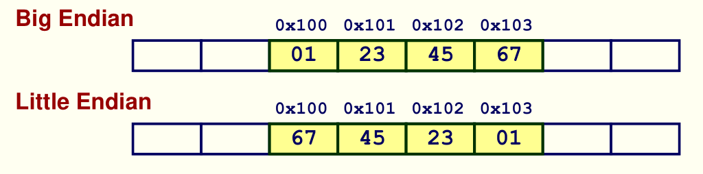
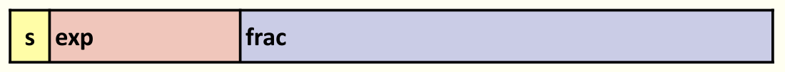
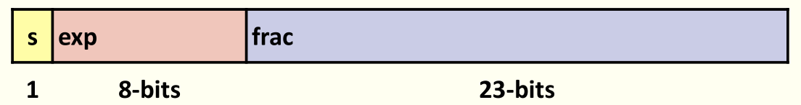
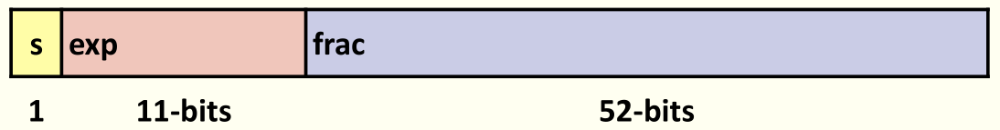
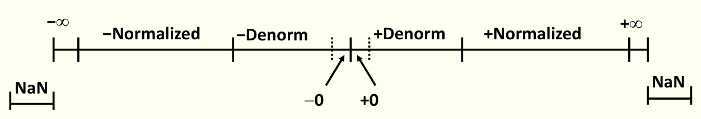
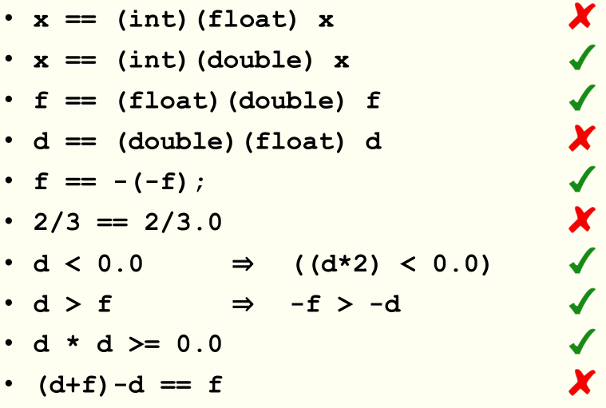

## Lecture 2 Bits, Bytes, & Integers -part 1

分为两个部分，主要介绍了机器中数据的存储方式及一些运算。

第一部分介绍了如下内容，重点是无符号数（unsigned）和有符号数（signed）的关系，包括他们在机器中的存储方式、表示范围、运算法则和转换关系。

+ 数据类型的宽度
+ 位级表示及运算与集合运算的关系
+ C 中的逻辑运算
+ 移位运算：逻辑移位与算术移位
+ 用二进制数对整数进行表示，包括有符号数和无符号数
+ 二进制表示的整数的数值范围（unsigned和signed）
+ unsigned 和 signed 之间的转换关系
+ 默认 signed 向 unsigned 转换带来的危险
+ 扩展 signed：符号位向前扩展
+ 扩展 unsigned：向前扩展 0
+ 截断 unsiged：模 $2^w$
+ 截断 signed

### 数据类型的宽度

| C Data Type | Typical 32-bit | Typical 64-bit | x86-64 |
| :---------: | :------------: | :------------: | :----: |
|    char     |       1        |       1        |   1    |
|    short    |       2        |       2        |   2    |
|     int     |       4        |       4        |   4    |
|    long     |       4        |       8        |   8    |
|    float    |       4        |       4        |   4    |
|   double    |       8        |       8        |   8    |
| long double |       -        |       -        | 10/16  |
|   pointer   |       4        |       8        |   8    |

### 移位运算

包括逻辑移位和数值移位，对于无符号数而言，无论是左移还是右移，两种移位是相同的，补 0 即可。对有符号数来说，左移两种移位方式都是在后面补 0，而右移，数值移位需要在前面补符号位，这牵涉到后面讲到的有符号数的扩展。

### 无符号整数

$$
B2U(X)=\Sigma^{w-1}_{i=0}x_i\cdot2^i
$$
### 有符号整数

$$
B2T(X)=-x_{w-1}\cdot2^{w-1}+\Sigma^{w-2}_{i=0}x_i\cdot2^i
$$

### 数值范围

+ 无符号：0~$2^w-1$
+ 有符号：$-2^{w-1}$~$2^{w-1}-1$

---

## Lecture 3 Bits, Bytes, & Integers -part 2

这是整数表示的第二部分，包括加法、取反、乘法和移位操作，此外还包含了数据在存储空间中的表示。

### 加法

unsigned 加，当最终结果的位数超出原来，直接舍去进位。

signed 加，也是直接舍去进位，但注意到，补码的加法会产生两种溢出，即数据过大向上溢出变成负数（positive overflow）和数据过小向下溢出变成正数（negtive overflow）。

### 乘法

先计算结果，在直接舍去前面的位，unsigned 和 signed 均是如此。

### 移位

移位和乘2^k是等价的，因此一些乘法可以用移位和加法组合实现，如：`(u<<5) - (u<<3) == u * 24`。

但需要注意的是，对 unsigned 进行的是逻辑移位，而对 signed 进行的是算术移位。

相应的当k为负数时，移位就和除法等价了。

### 取反

借助逐位取反我们可以得到一个补码的相反数，即 `~x + 1 == -x`，但是，**这条规则**对 `TMin` 并不成立，事实上`~TMin + 1 = TMin`，这不难想到，因为补码表示的范围为 $-2^{w-1}$~$2^{w-1}-1$，没有与 TMin 相对应的相反数。

### 字节顺序

数据在内存中是按照字节来存储，多字节的数据如何存储呢？

+ Big Endian：大端序，即低地址存放数据的高字节，依次类推。
+ Little Endian：小端序，即低地址存放数据的低字节。这是今天常用的处理器使用的数据存储方法。

下面以整数、指针和字符串在内存中的表示为例：

+ 整数早大端序和小端序机器上的表示顺序完全相反。
+ 指针的具体数值我们并不关心。
+ 字符串比较有意思，字符串中的每个字符都可以用一个字节的ASCII码表示，因此不存在字节顺序的问题，所以字符串大端序和小端序机器上的表示是相同的。

---

## Lecture 4 float

这一讲介绍的是浮点数，包括小数二进制数表示，IEEE754浮点数标准，浮点数的舍入规则、加法和乘法。

### Fractional binary numbers

`1011.101` 为例，小数点后面的数按照负指数依次进行计算即可，这在前面也提到了。一个好的计算方法是：

+ 对于小数部分，不考虑其为小数部分，按照 unsigned 数得出其数值，如例子中的 `.101` 为 5
+ 小数部分的位数为 k，将第一步得到的数值除以 2^k 即得到最终小数部分的值，如例子中的 k = 3，最终的小数部分数值为 5/8。

这种表示方法太局限了，要对 1/3 这样的小数进行精确表示，需要很多位数，此外对于固定位数的数，我们始终要在表示的数据范围和对小数表示的精确成都进行折中。

### Floating Point

这里介绍 IEEE 754 标准提出的浮点数，这也是当前所有主流 CPU 支持的浮点数标准。该标准易于实现浮点数的舍入、上溢出和下溢出，它的缺点是在硬件上实现起来较慢。

典型的浮点数表示如下，M取值为 [1.0, 2.0)。
$$
(-1)^s\cdot M \cdot 2^E
$$
对应到内存中，表示如下：

+ s  表示公式中的符号位 s
+ exp 表示公式中的 E（并不相等，存在转换关系）
+ frac 表示公式中的 M（并不相等，存在转换关系）

IEEE 754 主要提供了两种浮点数标准：单精度（32位）和双精度（64位）

这两种标准是相似的，只是数据位数不同，甚至我们自己也可以参考这种定义给出如 8 位浮点数的定义，容易帮助我们理解浮点数。

针对 e 的内容的不同，划分了浮点数的类型：

+ `00...00`：denormalized
+ `exp != 0 and exp != 11...11`: normalized
+ `11...11`: specail

#### Normalized

`exp != 0 and exp != 11...11`，此时 E = exp - *Bias*，

+ exp 为 exp 部分表示的 unsigned 值。
+ Bias = 2^{k-1}-1，k 为 exp 部分的位数。对于单精度，k = 8，Bias = 127，对于双精度，k=11，Bias = 1023。

公式中的 M 部分化为 `M = 1.xx...xxx`：

+ `xx...xxx` 作为 frac 部分
+ 最大为 `frac = 000...0 (M = 1.0)`
+ 最小为 `frac = 111...1 (M = 2.0 -\delta)`

由此得到了内存中 frac 部分和 exp 部分与原数据的对应关系，在考虑到符号位即可得出数据的浮点数表示。

#### Denormalized

上述表示的问题在于，对于 M < 1 的数据，无法进行处理，这部由 denormalized 定义：

+ `exp = 000...0`
+ Bias 和前面的定义相当，但是转换关系变成 E = 1 - Bias
+ M 表示为 `0.xxx...x`，`xxx...x` 作为 frac 部分

这样一来，exp 和 frac 所有位均为 0 时就可以表示数字 0 了，注意到这里仍然有 +0 和 -0 的区别。

#### Special

除了上面说到的，浮点数还有一种例外，即当 `exp = 111...1` 时：

+ `exp = 111..1`，`frac = 000...0`：表示 infinity 无穷大，用于表述数据运算中的溢出
+ `exp = 111...1`，`frac != 000...0`：表示 NaN 非数，用于表述数据运算中的无效运算结果，如 sqrt(-1)。

### Special Properties

+ 全 0 表示整数 0
+ 数据大小比较，几乎可以使用 unsigned 整数比较方法。当然有一些例外：
  + 首先比较符号位
  + -0 = 0
  + NaNs 大于任何数
  + 其他均是可以的

### Floating Point Rounding

加法也好，乘法也好，关键在于对结果的舍入，因为位数有限，只能如此。

+ 先计算准确的数值
+ 然后按照规则进行舍入

默认的舍入规则为向**就近 偶数（Nearest Even）**靠近，如 1.4 舍入为 1， 1.5 舍入为2.0，2.5 舍入为 2.0：基本上按照向最近的数靠近（1.4==>>1.0），但是当出于中间时，则向最近的偶数靠近（1.5==>>2.0）。所以这个名字可能有些困扰，它应该分为两部分理解：优先选择近的（Nearest），如果距离两个数距离相同（half-way），则选择偶数（even）。

十进制例子如下所示（有效位数为小数点后两位）：

+ 7.8949999 --->>> 7.89
+ 7.8940001 --->>> 7.90
+ 7.8950000 --->>> 7.90
+ 7.8850000 --->>> 7.88

在二进制中，even 表示最低有效位为 0，half-way 表示最低有效位后的为 `100...`。如下这几个例子（有效位数为小数点后两位）

+ 10.00011   ---->> 10.00
+ 10.00110   ---->> 10.01
+ 10.11100   ---->> 11.00
+ 10.10100   ---->> 10.10

### Floating Point Multiplication

按照如下规则计算：

+ s = s1 ^ s2
+ M = M1 * M2
+ E = E1 + E2

然后在进行转化和舍入。

### Floating Point Additon

对于 E 不相同的浮点数，先通过移位将 E 向较大的一方靠近，然后进行加法，再进行舍入。

### Mathematical Properties

+ 对加法封闭
+ 加法满足交换律 Commutative
+ 加法不满足结合率 Associative（因为舍入）
+ 对乘法封闭
+ 乘法满足交换律
+ 乘法不满足结合律（因为舍入）

### Floating Point in C

包括单精度 float 和双精度 double，注意他们的转换关系，即是否会产生误差，关注他们的位数即可，float 的 frac 长为23，int 长为 32，double frac 长为 52，根据短的向长的转换不会出现误差即可的得出结论。

